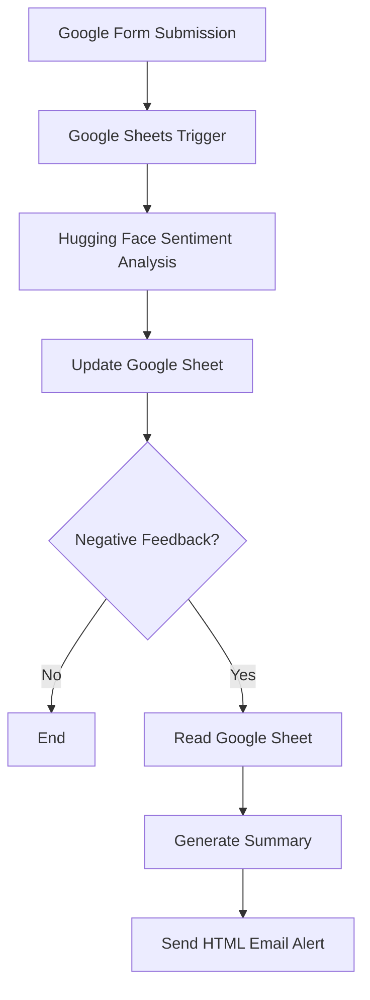

# Customer Feedback Sentiment Analysis Automation

## Overview

An end-to-end AI automation workflow built using n8n that analyzes customer feedback submitted through Google Forms.

The workflow classifies feedback sentiment using the Hugging Face Inference API, updates Google Sheets with sentiment labels and confidence scores, and automatically sends HTML email alerts whenever negative feedback is detected.

---

## Features

- Google Forms integration
- Automatic sentiment analysis
- Confidence score generation
- Google Sheets update
- Negative feedback detection
- HTML email alerts
- Real-time workflow automation

---

## Workflow

---

## Technologies

- n8n
- Hugging Face Inference API
- Google Sheets API
- Gmail
- JavaScript
- REST API

---

## Future Improvements

- Power BI Dashboard
- Slack Notifications
- Microsoft Teams Alerts
- Trend Analysis
- Weekly Reports
- AI-generated Feedback Summaries
